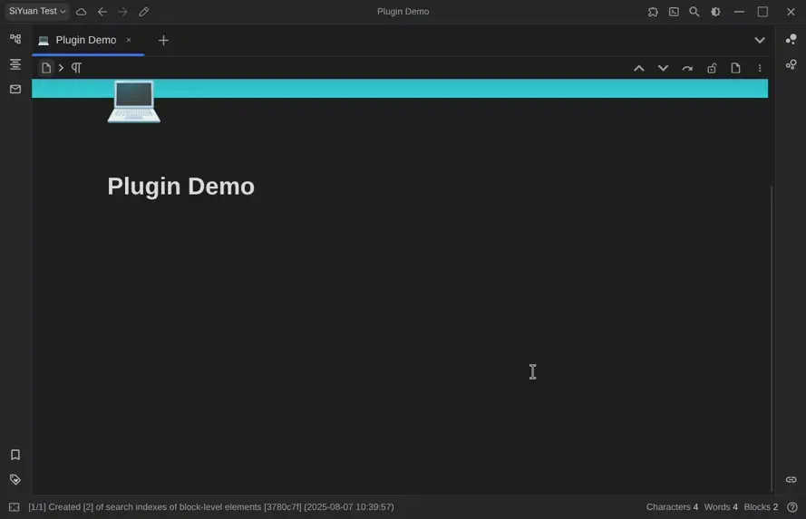

# SiYuan js-draw 插件

本插件可在思源笔记的任意位置内嵌 js-draw 白板。

## 使用说明

在插件市场搜索 `js-draw` 并安装。

### 新建白板

有两种方式新建白板：
- **斜杠命令** — 在文档中输入 `/插入白板`，选择对应菜单项。
- **快捷键 / 工具栏图标** — 在未选中任何白板的情况下按 `Alt+Shift+D` 或点击工具栏图标，将在光标位置插入新白板。默认会弹出确认对话框；可在 **设置 → 未选中白板时的快捷键行为** 中更改（`创建前询问` / `自动创建` / `不执行任何操作`）。

编辑器将在新标签页（移动端为对话框）中打开。随意绘制后，点击 **保存** 并关闭编辑器。

### 编辑白板

左键点击已有的白板将其选中，然后通过以下方式打开编辑器：
- 按 `Alt+Shift+D` 或点击工具栏图标。
- 右键白板（移动端点击三点按钮），选择 **插件 → 编辑白板**。

### 未保存的更改

关闭编辑器时若有未保存的更改，更改将被自动保存，您可以选择保留新版本或回滚到之前的版本。

应用退出时也会自动保存未保存的绘图。**注意：** 此紧急保存发生在思源笔记最终同步之后，因此在多设备使用场景下可能导致同步冲突。请养成手动保存后再关闭的习惯。

## 计划功能
查看 [Projects](https://git.boxo.cc/massivebox/siyuan-jsdraw-plugin/projects) 标签页了解详情！

## 贡献
欢迎任何形式的贡献！  
中文翻译由 Kimi AI 完成，因我不懂中文，如有疏漏欢迎指出。  
若您愿意协助，请 [提交 Issue](https://git.boxo.cc/massivebox/siyuan-jsdraw-plugin/issues) 或 [联系我](mailto:box@boxo.cc)。

## 致谢
本项目离不开以下项目与社区的帮助（排名不分先后）：
- [SiYuan](https://github.com/siyuan-note/siyuan) 项目
- [js-draw](https://github.com/personalizedrefrigerator/js-draw)
- [SiYuan plugin sample with vite and svelte](https://github.com/siyuan-note/plugin-sample-vite-svelte)
- [siyuan-drawio-plugin](https://github.com/zt8989/siyuan-drawio-plugin) 与 [siyuan-plugin-whiteboard](https://github.com/zuoez02/siyuan-plugin-whiteboard) 提供的灵感与部分代码

也请关注并支持他们！

## 许可证
原始插件框架由思源笔记开发，MIT 许可证。  
本人所作修改版权所有 © 2025 MassiveBox，同样使用 MIT 许可证。