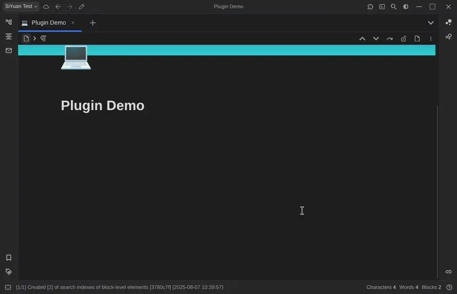

# SiYuan js-draw 插件

本插件可在思源笔记的任意位置内嵌 js-draw 白板。

## 使用说明

- 在插件市场搜索 `js-draw` 并安装。
- 在文档中新建白板：
    1. 在文档内输入 `/插入白板`，选择对应菜单项；
    2. 白板编辑器将在新标签页打开，随意绘制后点击“保存”并关闭标签页。
- 后续编辑白板：
    1. 左键（或轻触）选中白板，然后点击顶部工具栏的“编辑”图标，或使用快捷键 `Alt+Shift+D`；  
       ‑ 亦可右键白板（或移动端点击三点按钮），在菜单中选择“插件” > “编辑白板”；
    2. 编辑器标签页打开后，按需修改，完成后点击“保存”并关闭标签页。

## 计划功能
查看 [Projects](https://git.massive.box/massivebox/siyuan-jsdraw-plugin/projects) 标签页了解详情！

## 贡献
欢迎任何形式的贡献！  
中文翻译由 Kimi AI 完成，因我不懂中文，如有疏漏欢迎指出。  
若您愿意协助，请 [提交 Issue](https://git.massive.box/massivebox/siyuan-jsdraw-plugin/issues) 或 [联系我](mailto:box@massive.box)。

## 致谢
本项目离不开以下项目与社区的帮助（排名不分先后）：
- [SiYuan](https://github.com/siyuan-note/siyuan) 项目
- [js-draw](https://github.com/personalizedrefrigerator/js-draw)
- [SiYuan plugin sample with vite and svelte](https://github.com/siyuan-note/plugin-sample-vite-svelte)
- [siyuan-drawio-plugin](https://github.com/zt8989/siyuan-drawio-plugin) 与 [siyuan-plugin-whiteboard](https://github.com/zuoez02/siyuan-plugin-whiteboard) 提供的灵感与部分代码

也请关注并支持他们！

## 许可证
原始插件框架由思源笔记开发，MIT 许可证。  
本人所作修改版权所有 © 2025 MassiveBox，同样使用 MIT 许可证。