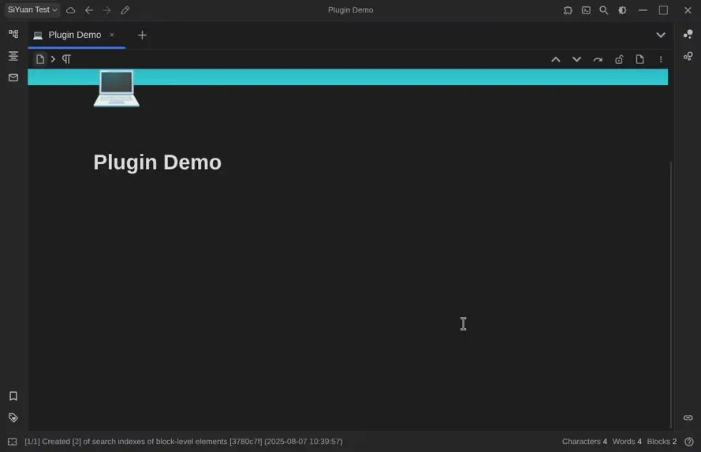

# SiYuan js-draw Plugin

This plugin allows you to embed js-draw whiteboards anywhere in your SiYuan documents.

## Usage instructions

- Install the plugin from the marketplace. You can find it by searching for `js-draw`. 
- To add a new whiteboard to your document:
  1. Type `/Insert whiteboard` in your document, and select the correct menu entry
  2. The whiteboard editor will open in a new tab. Draw as you like, then click the Save button and close the tab.
- To edit the whiteboard later:
  1. Left-click or tap on the whiteboard to select it, then click on the Edit icon in the top bar or use the keyboard shortcut `Alt+Shift+D`
     - Or right-click on the whiteboard (or click the three dots on mobile), select "Plugin" > "Edit whiteboard" in the menu
  2. The editor tab will open, edit your file as you like, then click the Save button and close the tab.

## Planned features
Check out the [Projects](https://git.massive.box/massivebox/siyuan-jsdraw-plugin/projects) tab!

## Contributing
Contributions are always welcome!  
The Chinese translation is made by Kimi AI, and I'm unable to verify it because I don't speak Chinese. If you do and find issues, please let me know.  
Please [open an issue](https://git.massive.box/massivebox/siyuan-jsdraw-plugin/issues) or [contact me](mailto:box@massive.box) if you'd like to help!

## Thanks to
This project couldn't have been possible without (in no particular order):
- The [SiYuan](https://github.com/siyuan-note/siyuan) project
- [js-draw](https://github.com/personalizedrefrigerator/js-draw)
- [SiYuan plugin sample with vite and svelte](https://github.com/siyuan-note/plugin-sample-vite-svelte)
- [siyuan-drawio-plugin](https://github.com/zt8989/siyuan-drawio-plugin) and
  [siyuan-plugin-whiteboard](https://github.com/zuoez02/siyuan-plugin-whiteboard) for inspiration and bits of code

Make sure you check them out and support them as well!

## License
The original plugin framework is developed by SiYuan 思源笔记 and licensed under the MIT license.  
All changes made by me are copyright MassiveBox 2025, and licensed under the MIT license.